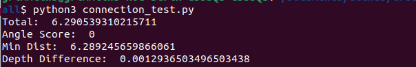

# internship_summer_2023
Work and documentation from my summer 2023 AgAID internship.

# What it is
The test_connectivity.py code takes in masks and depth images of trees, builds 3D cylinders along a bezier curve following a branch, and determines which side branches are connected to which main or "leader" branches.
The pull depth and rgb data file takes a .mkv video and extracts depth and rgb data in whatever format you wish.--> may require changes to test_connectivity to work with different formats.

# How it works
1. Builds a Bezier curve by determining the medial axis of the white space in a mask
   - This returns the radii, "t" value and the curve points at which the curve is evaluated, as well as a curve
2. Finds average depth in a cross-space of the tree branch
   - Uses numpy and opencv to do this by first drawing singular blue squares that align with the limits of the mask and the curve points, then by reading the depth image at those points
3. Determines the closest point and distance from the end points of the side branch to the curve of the leader and picks the closest two points
4. Determines the difference in depth between the two points
5. Determines the angle between the two tangent lines of each points
6. Returns a score based in those aspects that refers to how likely it is that the branches are connected (lower is better)
7. Plots curves and points it is evaluating
    
# Assumptions
- Leader and side branches are labeled as such
- Points are ordered
- There is a .mkv video file to work with
- There are masks to work with
  
# Notes for Running
- After cloning the repository, just run connection_test.py
- Adjust any of the parameters to include your own depth and mask images as well as a video file
- Requires OpenCV, Matplotlib, Skimage, Scipy, PyK4A, and Networkx libraries--> see Documentation for install PyK4A
- To pull RGB and Depth data, copy the python file to the directory where the .mkv video is stored(or alter code to specify a path)

# General Notes
- The curve_fitting and camera files are contribution from [Alex You](https://github.com/osu-youa)
- Azure camera depth data needs to be tested to confirm its conversion to meters
- generate_3d.py works with and requires Blender to run. It uses Blender to generate a Bezier curve rather than using cylinders. Unless scaled up, it generates a small curve in meters. Radius does not currently operate as expected.

# Output
The cylinders generated produce:

As compared to:

It displays in the terminal:

This shows the total score for how likely a side branch is to match to a leader branch(lower is better).

# Instructions for Installing PyK4A
- See: [Kinect on Ubuntu](https://github.com/juancarlosmiranda/azure_kinect_notes)
- And: [PyK4A](https://github.com/etiennedub/pyk4a)

# TODO:
- Test camera to confirm conversion between depth data and meters
- Implement loop to manage all files that need to be tested
- Implement loop to manage multiple frames from video footage
- Combine all cylinder files into one
